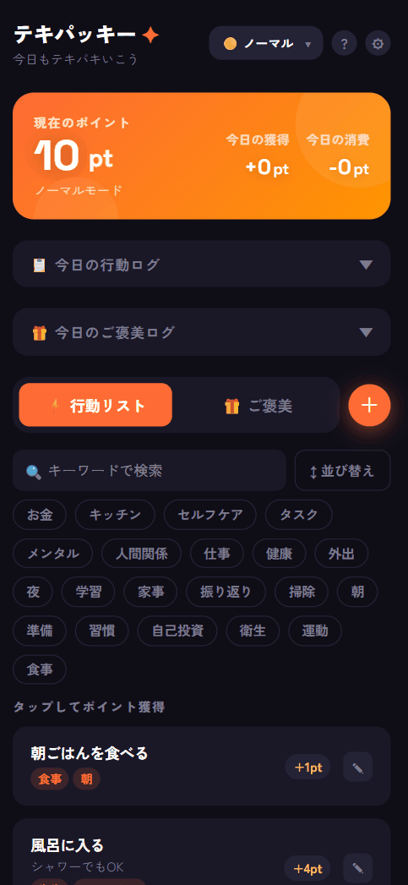

# テキパッキー (tekipacky)

テキパキと行動できるようになるための行動管理アプリ。

脳疲労によってやる気が枯渇している人が、風呂に入る・食器を洗うといった日常の行動にすら着手できない問題を解決する。行動をポイントに換算して少しずつ積み上げ、貯めたポイントでご褒美行動と交換できる仕組みにより、行動の動機づけをゲーム的に設計する。

<div align="center">
  
</div>

---

## 技術スタック

| カテゴリ | 技術 |
|---|---|
| フレームワーク | Next.js 16 (App Router) |
| UI | React 19, Tailwind CSS v4 |
| データベース | PostgreSQL 17 + Prisma 7 |
| 認証 | NextAuth v5 (next-auth@beta) + Resend |
| テスト（単体） | Vitest 4 + @testing-library/react |
| テスト（統合） | Vitest + 実 PostgreSQL (tmpfs) |
| テスト（E2E） | Playwright |
| 実行環境 | Docker Compose |
| CI | GitHub Actions |
| ホスティング | Raspberry Pi (Cloudflare Tunnel + Access) |

---

## プロジェクト構成

```
tekipacky/
├── web/                  # Next.js アプリ本体
├── docs/
│   ├── specification/    # 仕様書（API・コンポーネント・テスト等）
│   └── sprints/          # スプリント設計
├── .github/workflows/    # CI/CD (GitHub Actions)
└── README.md
```

---

## セットアップ

### 前提条件

- Docker 24+ / Docker Compose v2

### 起動手順

```bash
git clone <repo-url>
cd tekipacky/web

# 環境変数を設定（後述）
cp .env.example .env
# .env を編集

# コンテナを起動（初回はビルドに数分かかる）
docker compose up -d
```

アプリは http://localhost:3000 で起動する。

### 環境変数（`web/.env`）

| 変数名 | 説明 |
|---|---|
| `POSTGRES_USER` | PostgreSQL ユーザー名 |
| `POSTGRES_PASSWORD` | PostgreSQL パスワード |
| `POSTGRES_DB` | データベース名 |
| `DATABASE_URL` | Prisma 接続文字列（例: `postgresql://user:pass@db:5432/dbname`） |
| `AUTH_SECRET` | NextAuth 署名シークレット（`openssl rand -base64 32` で生成） |
| `AUTH_RESEND_KEY` | Resend API キー |
| `AUTH_EMAIL_FROM` | 送信元メールアドレス（例: `noreply@yourdomain.com`） |
| `AUTH_URL` | 本番ドメイン（例: `https://yourdomain.com`）、ローカルでは不要 |

---

## 開発

```bash
# コンテナに入る（web/ ディレクトリで実行）
docker compose exec app sh

# 開発サーバーはコンテナ起動時に自動起動（port 3000）
# 手動で起動する場合
npm run dev
```

### npm スクリプト

| スクリプト | 説明 |
|---|---|
| `npm run dev` | 開発サーバー起動 |
| `npm run build` | 本番ビルド |
| `npm run typecheck` | TypeScript 型チェック |
| `npm run lint` | ESLint 実行 |
| `npm run format` | Prettier フォーマット（書き換え） |
| `npm run format:check` | フォーマット検査のみ |
| `npm run seed` | シードデータ投入（50行動・50ご褒美） |

---

## テスト

### 単体テスト（325テスト）

```bash
docker compose exec app npm run test

# ウォッチモード（開発時）
docker compose exec app npx vitest
```

### 統合テスト（21テスト・実 PostgreSQL 使用）

```bash
# テスト用 DB を起動（port 5433、tmpfs）
docker compose -f docker-compose.test.yml up -d

# 統合テスト実行（メイン app コンテナから。dotenv-cli が .env.test を読み込む）
docker compose exec app npm run test:integration

# テスト後に DB を停止
docker compose -f docker-compose.test.yml down
```

### E2Eテスト（11テスト・開発サーバー必須）

```bash
# 開発 DB + 開発サーバーを起動
docker compose up -d

# E2Eテスト実行
docker compose exec app npm run test:e2e
```

---

## データベース操作

```bash
# マイグレーション作成（スキーマ変更後）
docker compose exec app npx prisma migrate dev --name <migration-name>
```

---

## CI（GitHub Actions）

`main` ブランチへの PR で `web/` 配下の変更を自動検査:

| ジョブ | 内容 |
|---|---|
| Format check | Prettier によるフォーマット検査 |
| Lint & Type check | ESLint + TypeScript 型チェック |
| Unit tests | Vitest 単体テスト |
| Integration tests | Vitest + PostgreSQL サービスコンテナによる統合テスト |

---

## ホスティング（本番環境）

本番環境は **自宅の Raspberry Pi** 上で **Docker Compose** によりコンテナとして稼働している。外部公開は **Cloudflare Tunnel** を使い、さらに **Cloudflare Access** でアクセス制限をかけている（許可したユーザーのみアクセス可能）。

大まかな構成:

- Raspberry Pi
  - Docker Compose で `app`（Next.js）や `db`（PostgreSQL）などを起動
- Cloudflare Tunnel
  - 自宅回線側から Cloudflare へトンネルを張って公開（ルータのポート開放を不要にする）
- Cloudflare Access
  - アプリ到達前に認証・許可を要求し、公開範囲を制御する

---

## CD（自動デプロイ）

GitHub Actions の `cd.yml` により、`main` ブランチへの push（`web/**` の変更）をトリガーに **ビルド→レジストリへ push→Raspberry Pi へ反映** までを自動で行う。

大まかな流れ:

1. **Build & Push**
   - `web/` をコンテキストに Docker イメージを **linux/arm64** でビルドし、GitHub Container Registry（GHCR）へ push

2. **Deploy to Raspberry Pi**
   - Actions から **Tailscale** で自宅ネットワーク（Pi）へ安全に到達
   - Compose ファイルを Pi へコピーし、Secrets 由来の `.env` を配置
   - Pi 側で GHCR から最新イメージを `docker pull` し、Compose で起動（DB が未起動なら全サービス、起動済みなら `app` のみ更新）
   - 古いイメージを prune して容量を整理

---

## ドキュメント

詳細な仕様は `docs/specification/` を参照。

| ドキュメント | 内容 |
|---|---|
| [overview.md](docs/specification/overview.md) | アーキテクチャ・ディレクトリ構造・データフロー |
| [api.md](docs/specification/api.md) | API エンドポイント仕様 |
| [data-model.md](docs/specification/data-model.md) | データモデル・ER図 |
| [point-system.md](docs/specification/point-system.md) | ポイント計算ロジック |
| [components.md](docs/specification/components.md) | UIコンポーネント仕様 |
| [authentication.md](docs/specification/authentication.md) | 認証フロー（NextAuth v5 + Resend） |
| [testing/README.md](docs/specification/testing/README.md) | テスト方針・パターン・実行方法 |
